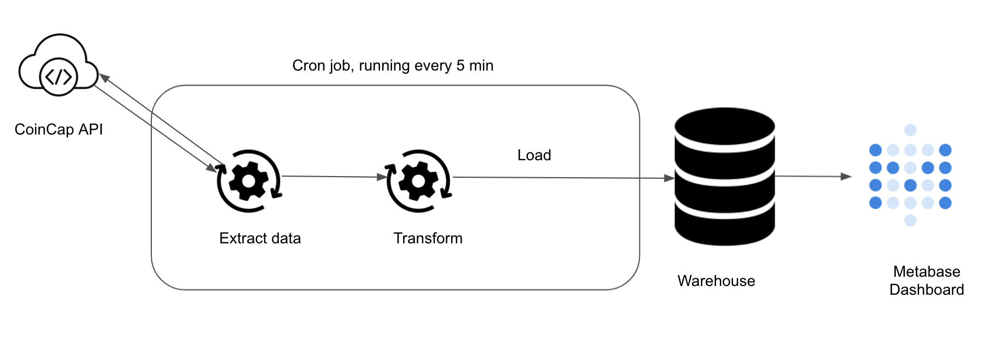

# Bitcoin Monitor

This is an ETL pipeline to pull bitcoin exchange data from [CoinCap API](https://docs.coincap.io/) and load it into our data warehouse. For more details check out the blog at https://startdataengineering.com/post/data-engineering-project-to-impress-hiring-managers/

## Architecture



We use python to pull, transform and load data. Our warehouse is postgres. We also spin up a Metabase instance for our presentation layer.

All of the components are running as docker containers.
## Setup

### Pre-requisites

1. [git](https://git-scm.com/book/en/v2/Getting-Started-Installing-Git)
2. [Github account](https://github.com/)
3. [Terraform](https://learn.hashicorp.com/tutorials/terraform/install-cli) 
4. [AWS account](https://aws.amazon.com/) 
5. [AWS CLI installed](https://docs.aws.amazon.com/cli/latest/userguide/install-cliv2.html) and [configured](https://docs.aws.amazon.com/cli/latest/userguide/cli-chap-configure.html)
6. [Docker](https://docs.docker.com/engine/install/) with at least 4GB of RAM and [Docker Compose](https://docs.docker.com/compose/install/) v1.27.0 or later

Read **[this post](https://www.startdataengineering.com/post/data-engineering-projects-with-free-template/)**, for information on setting up CI/CD, DB migrations, IAC(terraform), "make" commands and automated testing.

Run these commands to setup your project locally and on the cloud.

```shell
# Clone the code as shown below.
git clone https://github.com/josephmachado/bitcoinMonitor.git
cd bitcoinMonitor

# Local run & test
make up # start the docker containers on your computer & runs migrations under ./migrations
make ci # Runs auto formatting, lint checks, & all the test files under ./tests

# Create AWS services with Terraform
make tf-init # Only needed on your first terraform run (or if you add new providers)
make infra-up # type in yes after verifying the changes TF will make

# Wait until the EC2 instance is initialized, you can check this via your AWS UI
# See "Status Check" on the EC2 console, it should be "2/2 checks passed" before proceeding

make cloud-metabase # this command will forward Metabase port from EC2 to your machine and opens it in the browser
```

You can connect metabase to the warehouse with the configs in the [env](https://github.com/josephmachado/bitcoinMonitor/blob/main/env) file. Refer to [this doc](https://www.metabase.com/docs/latest/users-guide/07-dashboards.html) for creating a Metabase dashboard.

Create [database migrations](https://www.startdataengineering.com/post/data-engineering-projects-with-free-template/#43-database-migrations) as shown below.

```shell
make db-migration # enter a description, e.g., create some schema
# make your changes to the newly created file under ./migrations
make warehouse-migration # to run the new migration on your warehouse
```

For the [continuous delivery](https://github.com/josephmachado/bitcoinMonitor/blob/main/.github/workflows/cd.yml) to work, set up the infrastructure with terraform, & defined the following repository secrets. You can set up the repository secrets by going to `Settings > Secrets > Actions > New repository secret`.

1. **`SERVER_SSH_KEY`**: We can get this by running `terraform -chdir=./terraform output -raw private_key` in the project directory and paste the entire content in a new Action secret called SERVER_SSH_KEY.
2. **`REMOTE_HOST`**: Get this by running `terraform -chdir=./terraform output -raw ec2_public_dns` in the project directory.
3. **`REMOTE_USER`**: The value for this is **ubuntu**.

### Tear down infra

After you are done, make sure to destroy your cloud infrastructure.

```shell
make down # Stop docker containers on your computer
make infra-down # type in yes after verifying the changes TF will make
```