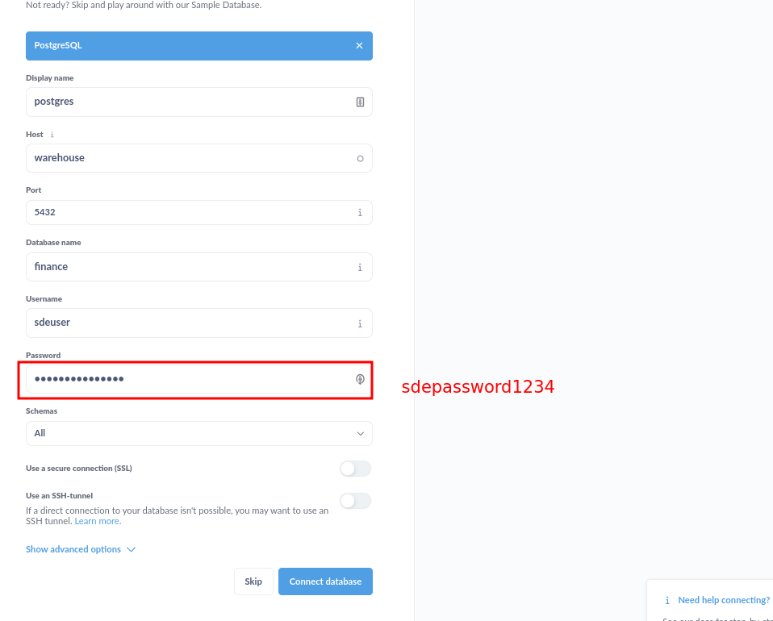
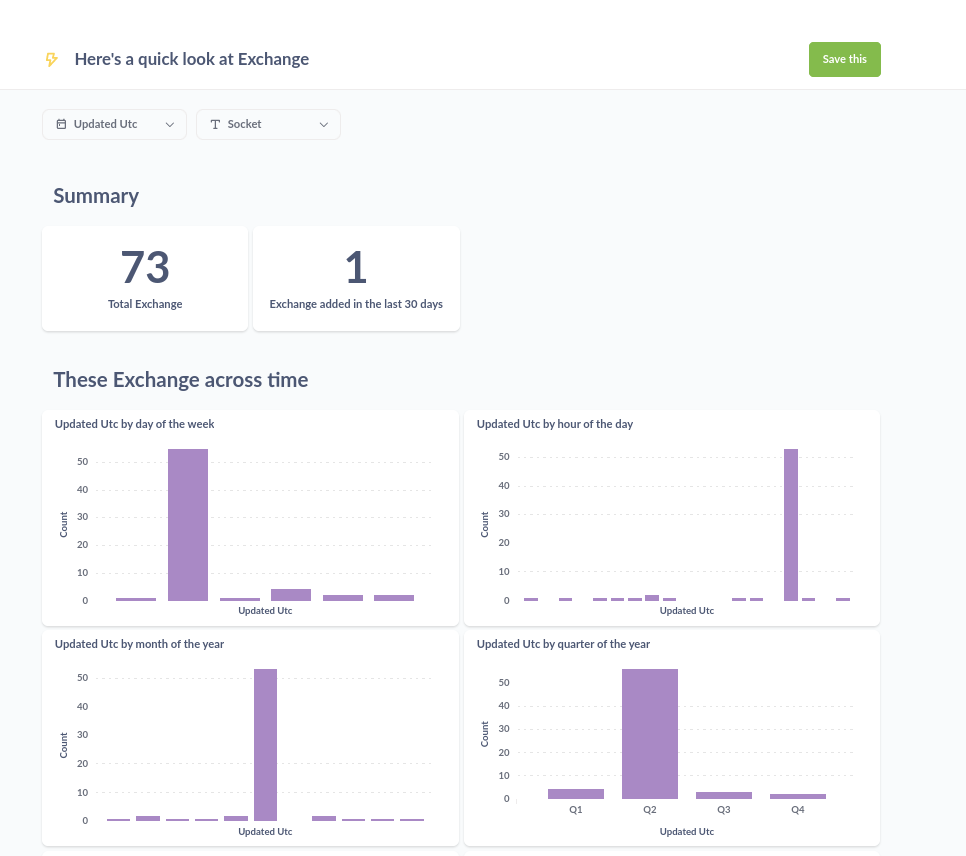

* [Bitcoin Monitor](#bitcoin-monitor)
    * [Run Data Pipeline](#run-data-pipeline)
        * [Run on codespaces](#run-on-codespaces)
        * [Run locally](#run-locally)
    * [Architecture](#architecture)

# Bitcoin Monitor

This is an ETL pipeline to pull bitcoin exchange data from [CoinCap API](https://docs.coincap.io/) and load it into our data warehouse. For more details check out the blog at https://startdataengineering.com/post/data-engineering-project-to-impress-hiring-managers/

## Run Data Pipeline

Code available at **[bitcoinMonitor](https://github.com/josephmachado/bitcoinMonitor/tree/main)** repository.

### Run on codespaces

You can run this data pipeline using GitHub codespaces. Follow the instructions below.

1. Create codespaces by going to the **[bitcoinMonitor](https://github.com/josephmachado/bitcoinMonitor/tree/main)** repository, forking it and then clicking on `Create codespaces on main` button.
2. Wait for codespaces to start, then in the terminal type `make up`.
3. Wait for `make up` to complete, and then wait for 30s (give Metabase sometime to setup).
4. After 30s go to the `ports` tab and click on the link exposing port `3000` to access Metabase UI (username and password is `sdeuser` and `sdepassword1234` respectively). See `metabase connection settings` screenshot below for connection details.

**Note**: The screenshots show how to run a project on codespaces, please make sure to use the instructions above for this specific project.


**Metabase connection settings:**


The metabase UI will look like the following


**Note** Make sure to switch off codespaces instance, you only have limited free usage; see docs [here](https://github.com/features/codespaces#pricing).

### Run locally

To run locally, you need:

1. [git](https://git-scm.com/book/en/v2/Getting-Started-Installing-Git)
2. [Github account](https://github.com/)
3. [Docker](https://docs.docker.com/engine/install/) with at least 4GB of RAM and [Docker Compose](https://docs.docker.com/compose/install/) v1.27.0 or later

Clone the repo and run the following commands to start the data pipeline:

```bash
git clone https://github.com/josephmachado/bitcoinMonitor.git
cd bitcoinMonitor
make up
sleep 30 # wait for Metabase to start
make ci # run checks and tests
```
Go to [http:localhost:3000](http:localhost:3000) to see the Metabase UI.


## Architecture


We use python to pull, transform and load data. Our warehouse is postgres. We also spin up a Metabase instance for our presentation layer.

All of the components are running as docker containers.

Read **[this post](https://www.startdataengineering.com/post/data-engineering-projects-with-free-template/)**, for information on setting up CI/CD, IAC(terraform), "make" commands and automated testing.

